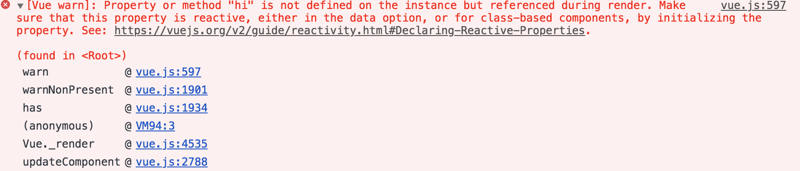

# 3 `_init`

```html
<div id="app">{{msg}}</div>
```

```js
new Vue({
  el: '#app',
  data: {
    msg: `hi~vue`
  }
})
```

在 `src/core/instance/init.js` 定义，在 `new Vue()` 时调用（构造方法位于 `src/core/instance/index.js`）。

## 实例 uid 和性能监控

```js
Vue.prototype._init = function (options?: Object) {
  const vm: Component = this
  // 递增 ID（每一个 vue 实例有唯一的 uid）
  vm._uid = uid++

  // a flag to avoid this being observed
  vm._isVue = true

  // 性能监控 performance API 见 https://developer.mozilla.org/en-US/docs/Web/API/Performance/mark
  let startTag, endTag
  /* istanbul ignore if */
  if (process.env.NODE_ENV !== 'production' && config.performance && mark) {
    startTag = `vue-perf-start:${vm._uid}`
    endTag = `vue-perf-end:${vm._uid}`
    mark(startTag)
  }

  // ...

  /* istanbul ignore if */
  if (process.env.NODE_ENV !== 'production' && config.performance && mark) {
    vm._name = formatComponentName(vm, false)
    mark(endTag)
    measure(`vue ${vm._name} init`, startTag, endTag)
  }
```

通过 `Vue.config.performance = true` 开启性能监控，然后在支持 performance API 的浏览器下进行分析（F12-> performance Tab下）

## `$options` 初始化

```js
// 目前没见到过 _isComponent，走 else 分支
// 针对内部组件的优化处理（因为动态合并 options 比较慢，而内部组件不需要特殊处理）
if (options && options._isComponent) {
  initInternalComponent(vm, options)
} else {
  vm.$options = mergeOptions(
    resolveConstructorOptions(vm.constructor),
    options || {},
    vm
  )
}
```

重点来了，`mergeOptions` 函数生成了 `$options`。

`resolveConstructorOptions` 递归的解析构造函数上的 `options`，以及一些 bug fix 逻辑，我们继续看 `mergeOptions` 函数。

```js
/**
 * Merge two option objects into a new one.
 * Core utility used in both instantiation and inheritance.
 */
export function mergeOptions (
  parent: Object,
  child: Object,
  vm?: Component
): Object {
  // 检查组件名
  // 1. /^[a-zA-Z][\w-]*$/.test(name)
  // 2. !isBuiltInTag(name) || !isReservedTag
  checkComponents(child)
  // @src/platforms/web/runtime/index.js
  // Vue.config.isReservedTag = isReservedTag

  // @src/platforms/web/util/element.js
  // export const isReservedTag = (tag: string): ?boolean => {
  //   return isHTMLTag(tag) || isSVG(tag)
  // }

  // 比如 Vue 构造函数，比如 Vue.extend 生成的构造函数
  if (typeof child === 'function') {
    child = child.options
  }

  // 规范化 props
  // ['x-y'] 统一到 { xY: { type: null }}
  // { 'x-y': Number} 统一到 { xY: { type: Number }}
  normalizeProps(child, vm) // 输出到 child.options

  // 规范化 inject
  // ['x'] 统一到: {x: { from: 'x' }}
  // { x: 'y' } 统一到: {x: { from: 'y' }}
  // { x: { z: 'y' }} 统一到: { x: { from: 'x', z: 'y' }}
  normalizeInject(child, vm)

  // 规范化指令
  // directive('x', function (){ }) 统一到 { bind: func, update: func }
  normalizeDirectives(child)

  // TODO: 这是在做什么？
  if (!child._base) {
    if (child.extends) {
    }
    if (child.mixins) {
    }
  }
  // 然后处理 extends 和 mixins 的情况，将要 extend 或 mixin 的属性 merge 到 parent 上
  // 重点来了，怎么生成 option
  const options = {}
  let key
  for (key in parent) {
    mergeField(key)
  }
  for (key in child) {
    if (!hasOwn(parent, key)) {
      mergeField(key)
    }
  }
  function mergeField (key) {
    // 看起来每个属性都要通过 strat 来生成
    const strat = strats[key] || defaultStrat
    options[key] = strat(parent[key], child[key], vm, key)
  }
  return options
}

// strat
const strats = config.optionMergeStrategies
```

## `options.js` 中的其它合并策略

```js
// 默认合并策略
const defaultStrat = function (parent, child) {
  return child === undefined ? parent : child
}
// el、propsData 合并策略: defaultStrat
strats.el = strats.propsData = function (parent, child, vm, key) {}

// data 合并策略
strats.data = function (
  parentVal: any,
  childVal: any,
  vm?: Component
): ?Function {
  if (!vm) { // ⚠️在处理子组件时（比如 Vue.extend），这里的合并策略中 vm 为 undefined
    if (childVal && typeof childVal !== 'function') {
      process.env.NODE_ENV !== 'production' && warn(
        'The "data" option should be a function ' +
        'that returns a per-instance value in component ' +
        'definitions.',
        vm
      )

      return parentVal
    }
    return mergeDataOrFn(parentVal, childVal) // mergeDataOrFn 返回函数保证了 data 为函数
  }

  return mergeDataOrFn(parentVal, childVal, vm)
}

// 生命周期勾子合并策略
LIFECYCLE_HOOKS.forEach(hook => {
  strats[hook] = mergeHook
})

function mergeHook (
  parentVal: ?Array<Function>,
  childVal: ?Function | ?Array<Function>
): ?Array<Function> {
  return childVal
    ? parentVal
      ? parentVal.concat(childVal)
      : Array.isArray(childVal)
        ? childVal
        : [childVal]
    : parentVal
}

// mergeAssets: 组件/指令/过滤器的合并策略
ASSET_TYPES.forEach(function (type) { // ASSET_TYPES: ['component', 'filter', 'directive']
  strats[type + 's'] = mergeAssets
})

function mergeAssets (
  parentVal: ?Object,
  childVal: ?Object,
  vm?: Component,
  key: string
): Object {
  const res = Object.create(parentVal || null) // 原型传递，比如内置组件任何地方都能直接使用
  if (childVal) {
    process.env.NODE_ENV !== 'production' && assertObjectType(key, childVal, vm)
    return extend(res, childVal)
  } else {
    return res
  }
}

// watch 合并策略
// 合并为函数数组或单个函数
strats.watch = function (
  parentVal: ?Object,
  childVal: ?Object,
  vm?: Component,
  key: string
): ?Object {}

// props、methods、inject、computed 合并策略: parent ? extend({}, parent, ?child) : child
strats.props =
strats.methods =
strats.inject =
strats.computed = function (
  parentVal: ?Object,
  childVal: ?Object,
  vm?: Component,
  key: string
): ?Object {}

// provide 合并策略
strats.provide = mergeDataOrFn
```


## 渲染代理

```js

if (process.env.NODE_ENV !== 'production') {
  // 这个代理整体是为了检查在 template 中使用的属性/方法是否被定义，在非生产环境提示
  initProxy(vm)
} else {
  vm._renderProxy = vm
}
```

比如一个没有定义`hi`属性的错误:

```js
new Vue({
  template: `<div>{{hi}}</div>`,
  el: '#app',
  data () {
    return {
      msg: 'hi~'
    }
  }
})
```



来看 `initProxy` 的实现:

```js
// src/core/instance/proxy.js
initProxy = function initProxy (vm) {
  if (hasProxy) {
    // determine which proxy handler to use
    const options = vm.$options
    const handlers = options.render && options.render._withStripped
      ? getHandler
      : hasHandler
    // Proxy API doc: https://developer.mozilla.org/en-US/docs/Web/JavaScript/Reference/Global_Objects/Proxy
    vm._renderProxy = new Proxy(vm, handlers)
  } else {
    vm._renderProxy = vm
  }
}

const hasProxy = typeof Proxy !== 'undefined' && isNative(Proxy)

// has 代理: 告警属性未定义就使用
// `allowedGlobals` 允许直接使用 `Number` 等全局 API
// `_xx` 允许调用 _ 开头的属性，比如渲染函数
const hasHandler = {
  has (target, key) {
    const has = key in target
    const isAllowed = allowedGlobals(key) || (typeof key === 'string' && key.charAt(0) === '_')
    if (!has && !isAllowed) {
      warnNonPresent(target, key)
    }
    return has || !isAllowed
  }
}

// 内置 keyCodes 修改告警
if (hasProxy) {
  const isBuiltInModifier = makeMap('stop,prevent,self,ctrl,shift,alt,meta,exact')
  config.keyCodes = new Proxy(config.keyCodes, {
    set (target, key, value) {
      if (isBuiltInModifier(key)) {
        warn(`Avoid overwriting built-in modifier in config.keyCodes: .${key}`)
        return false
      } else {
        target[key] = value
        return true
      }
    }
  })
}
```

这里针对 `_withStripped` 变量作区分，是因为有些场景里自定义了 render 函数，导致无法在下面这种方式下执行（见前面错误信息示例，TODO: render 知识补充），属性都是直接通过 `vm['hi']` 来访问的:

```js
(function anonymous(
) {
with(this){return _c('div',[_v(_s(hi))])}
})
```

## 其余几个初始化

### `initLifecycle`

```js
// 将子组件加入到 $children，同时 $parent 指向父组件
export function initLifecycle (vm: Component) {
  const options = vm.$options

  // 抽象组件一般不渲染真实DOM，比如 transition，并且不会出现在父子关系里
  let parent = options.parent
  if (parent && !options.abstract) {
    while (parent.$options.abstract && parent.$parent) {
      parent = parent.$parent
    }
    parent.$children.push(vm)
  }

  vm.$parent = parent
  vm.$root = parent ? parent.$root : vm
  // 其它初始化属性
  vm.$children = []
  vm.$refs = {}

  vm._watcher = null
  vm._inactive = null
  vm._directInactive = false
  vm._isMounted = false
  vm._isDestroyed = false
  vm._isBeingDestroyed = false
}
```

### `initEvents`

```js
export function initEvents (vm: Component) {
  vm._events = Object.create(null)
  vm._hasHookEvent = false
  // _parentListeners 在 core/vdom/create-component.js
  const listeners = vm.$options._parentListeners
  if (listeners) {
    updateComponentListeners(vm, listeners)
  }
}
```

### `initRender`

生成 `$slot`、`$scopedSlots`、`$attrs`、`$listeners`。

```js
export function initRender (vm: Component) {
  vm._vnode = null // the root of the child tree
  vm._staticTrees = null // v-once cached trees
  const options = vm.$options
  const parentVnode = vm.$vnode = options._parentVnode // the placeholder node in parent tree
  const renderContext = parentVnode && parentVnode.context
  vm.$slots = resolveSlots(options._renderChildren, renderContext)
  vm.$scopedSlots = emptyObject
}
```

### 其它初始化

可以看到在`beforeCreate`和`created`钩子之间初始化了`inject`、`state`（props、methods、data、computed、watch）、`provide`

```js
callHook(vm, 'beforeCreate')
initInjections(vm) // resolve injections before data/props
initState(vm) // 按顺序初始化 props、 methods、data、computed、watch
initProvide(vm) // resolve provide after data/props
callHook(vm, 'created')
```